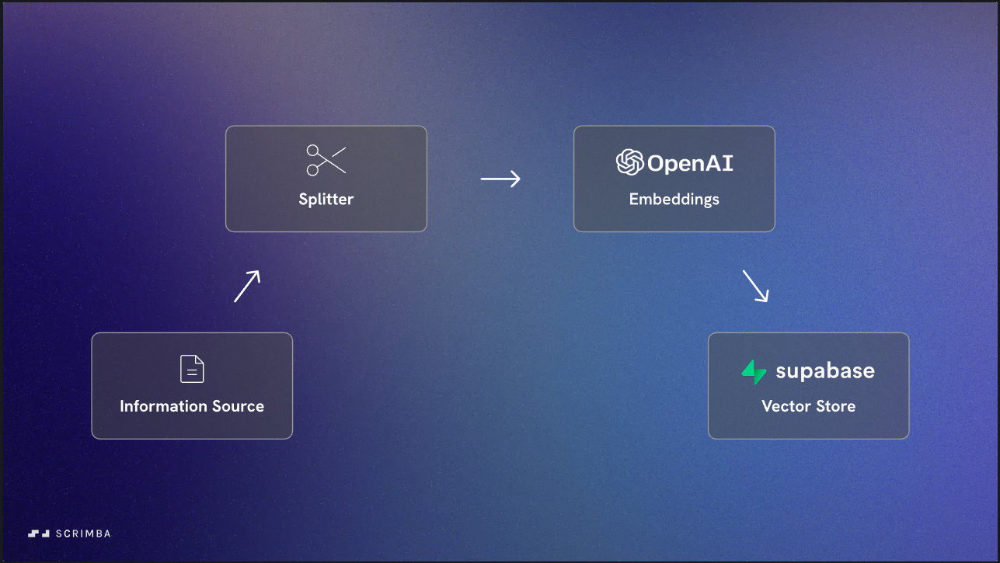

# Overview

This document provides a high-level overview of how our chatbot application works. The chatbot is designed to be knowledgeable about a specific topic — in this case, an example document generated by AI. The application utilizes LangChain tools, OpenAI models, and a Supabase vector store to process and retrieve information.

## Data Preparation

### Information Source

- We begin with an **information source** that contains all the knowledge we want the chatbot to have.

### Splitting the Document

- Use a **Splitter** (a LangChain tool) to divide the document into smaller, manageable chunks.
- Splitting helps in efficient processing and retrieval of information.

### Creating Embeddings

- Employ an **OpenAI embeddings model** to convert each chunk into vector representations.
- These vectors capture the semantic meaning of the chunks.

### Storing Vectors

- Save the vectorized chunks into a **Supabase vector store**.
- Once established, the vector store holds all the knowledge required by the chatbot.
- This process doesn't need to be repeated unless new data is added.

## Application Flow

### User Interaction

- The user inputs a question or query about the document.
- The input is processed in two ways:
  1. **Conversation Memory Store**: The input is saved to maintain the entire conversation history.
  2. **Standalone Question Conversion**: An OpenAI model converts the input into a standalone, concise question without unnecessary words.

### Retrieving Relevant Information

- Convert the standalone question into vectors using the OpenAI embeddings model.
- Send these vectors to the Supabase vector store.
- Retrieve the chunks with the nearest match—those most likely to contain the answer.

### Generating the Final Answer

- Use an OpenAI model to generate the final answer.
- Provide the model with three pieces of information:
  1. **Nearest Matches** from the vector store.
  2. **Original User Input**.
  3. **Conversation Memory** (the entire conversation so far).

### Delivering the Response

- Store the response in the conversation memory for continuity.
- Render the response to the user interface (DOM).